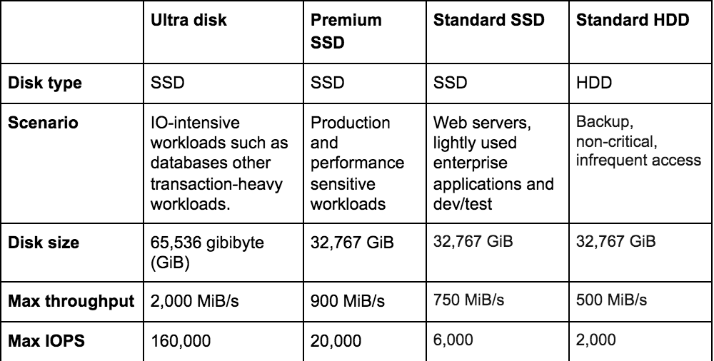

# Best Practices

This section of the deployment guide covers recommendations for compute, storage, network and more.

### Azure Resource Manager

Azure Resource Manager is the deployment and management service for Azure. It provides a management layer that enables you to create, update, and delete resources in your Azure subscription. You use management features, like access control, locks, and tags, to secure and organize your resources after deployment.

We recommend all deployments use Azure Resource Manager (ARM). This is Microsoft's latest deployment mechanism. It numerous features over other deployment mechanisms that range from a consistent management layer to parallel deployments to availability sets (for better high availability and rack awareness) to a restructuring of the fundamental deployment model.

Primary Benefits of ARM are listed below:
* Manage your infrastructure through declarative templates rather than scripts.
* Deploy, manage, and monitor all the resources for your solution as a group, rather than handling these resources individually.
* Redeploy your solution throughout the development lifecycle and have confidence your resources are deployed in a consistent state.
* Define the dependencies between resources so they're deployed in the correct order.
* Apply access control to all services in your resource group because Role-Based Access Control (RBAC) is natively integrated into the management platform.
* Apply tags to resources to logically organize all the resources in your subscription.
* Clarify your organization's billing by viewing costs for a group of resources sharing the same tag.

## Compute

### Recommended Machine Types

The minimal recommended config for DataStax Enterprise is 4 cores, 8GB RAM and 80GB of disk.  Those recommendations are given [here](http://docs.datastax.com/en/latest-dse/datastax_enterprise/install/installDEBdse.html).

### D, F and H Series

In the past many of the DataStax workloads on Azure have relied on instances with ephemeral storage but now more customers use Azure VMs that support managed disks and premium storage.

We find that the following D series v3 machines have a good mix of resources for general DSE applications:

 * Standard_D4s_v3,
 * Standard_D8s_v3,
 * Standard_D16s_v3
 * Standard_D32s_v3

The HB-series VMs are optimized for HPC applications driven by memory bandwidth like DSE graph and solr. HC VMs feature 44 Intel Xeon Platinum 8168 processor cores, 8 GB of RAM per CPU core, no hyperthreading, and up to 4 Managed Disks. The Intel Xeon Platinum platform supports Intel’s rich ecosystem of software tools and features an all-cores clock speed of 3.4 GHz for most workloads. Some suitable for DSE are:

* H8
* H8m
* H16
* H16m
* H16r
* H16mr

F-series VMs feature a higher CPU-to-memory ratio for analytics workloads like DSE Spark. They are equipped with 2 GB RAM and 16 GB of local solid state drive (SSD) per CPU core, and are optimized for compute intensive workloads. The Fsv2-series features 2 GiB RAM and 8 GB of local temporary storage (SSD) per vCPU. The Fsv2-series is hyper-threaded and based on the 2.7 GHz Intel Xeon® Platinum 8168 (SkyLake) processor, which can achieve clock speeds as high as 3.7 GHz with the Intel Turbo Boost Technology 2.0. Some suitable for DSE are:

* Standard_F8
* Standard_F16

## Disk Types

The following table provides a comparison of ultra disks, premium solid-state-drives (SSD), standard SSD, and standard hard disk drives (HDD) for managed disks to help you decide what to use.

### Azure Premium Storage

Azure premium SSDs deliver high-performance and low-latency disk support for virtual machines (VMs) with input/output (IO)-intensive workloads. To take advantage of the speed and performance of premium storage disks, you can migrate existing VM disks to Premium SSDs. Premium SSDs are suitable for mission-critical production applications. Premium SSDs can only be used with VM series that are premium storage-compatible.	

Premium Storage is used by most DSE customers today.	P30s and P40s are common		

1TB of data per node is typically a sweet spot in DataStax performance. Configurations such as 2xP30 or 1xP40 on each drive and the remainder reserved for compaction with give a good balance of node density, rebuild time and compaction space. Similarly 4xP30 with 250GB on each drive will perform well.

We advise against configurations where large amounts of data (for instance 10TB) is stored on each node. This will lead to long rebuild times and compromised availability.

To simplify management of storage accounts and dependencies between nodes, we recommend a premium storage account per node when using Premium Storage. Azure has a 100 storage account per subscription quota by default on EA accounts. This can be raised by contacting Azure support.

### JBOD vs Raid
* Raid 0 is recommended over JBOD 

## Network

One of the best things about DataStax Enterprise is its ability to continue running even after the loss of one or more data centers. Azure provides more regions than any other cloud provider, making Azure a great place to deploy DataStax Enterprise.

VMs deployed in Azure must each be assigned a private IP address. That address belongs to a NIC that belongs to a vnet. Vnets, in turn belong to a region. Private IP addresses are not routable across regions by default. Instead, the network must be configured to route traffic across vnets.

Azure provides three options to accomplish that:

* Public IP Addresses
* VPN Gateway
* VNET Peering

For most cross region DataStax deployments we suggest using VNET Peering. More details on each option is given below.

When using any of the options in Azure we suggest lowering the tcp_keepalive value to 120 seconds. This is due to Azure gateways having a 240 second timeout on all idle tcp streams. To accomplish this in /etc/sysctl.conf add the following line:

sysctl -w net.ipv4.tcp_keepalive_time=120

### Public IP Addresses
Each node in a cluster can be assigned a public IP address. That DataStax Enterprise cluster can then be configured to communicate using those public IPs. Traffic destined for Azure services with public IP addresses can be kept within the Azure backbone network. Bandwidth is limited by the bandwidth cap on the virtual machine. In general bandwidth caps are higher the larger the virtual machine. In testing, we have seen throughput ranging from 2-6 Gbps on a machine with an 8 Gbps bandwidth cap.

Public IPs can be either dynamic or static. Static IPs are reserved indefinitely. A dynamic IP is reserved when attached to a machine. The dynamic IP remains assigned indefinitely through reboots and even hardware failures of the machine. It will only be reassigned if the machine is stopped or deleted. 

Network Security Groups can be configured to prevent outside access to the nodes, ensuring that the public IPs are only used for routing traffic between nodes.

Public IPs are an option for development environments. For production environments VNET Peering for cross region communication is the best practice. (see section below).

### VPN Gateway
A VPN gateway is a specific type of virtual network gateway that is used to send encrypted traffic between an Azure virtual network and an on-premises location over the public Internet. You can also use a VPN gateway to send encrypted traffic between Azure virtual networks over the Microsoft network. Each virtual network can have only one VPN gateway. However, you can create multiple connections to the same VPN gateway. When you create multiple connections to the same VPN gateway, all VPN tunnels share the available gateway bandwidth.

VPN Gateways come in a few flavors, a standard gateway and a high performance gateway. The high performance gateway has a theoretical bandwidth of 200Mbps. In practice rates in the mid 150Mbps have been observed. Given the low bandwidth we typically do not recommend VPN gateways for DataStax clusters.

The setup of VPN gateways is somewhat complex. A gateway must be created in every vnet you wish to connect. Then uni-directional connections must be created between each gateway. For a cluster with n datacenters, n*(n-1) connections must be created. Deployment times for a VPN gateway can be as much as an hour. Connections typically take only a few minutes to establish once the gateways are in place.

Each VPN gateway is made up of two Azure machines deployed as a fault tolerant pair.

If you must use VPN gateways, use the high performance ones. 

### VNET Peering
Virtual network peering enables you to seamlessly connect Azure virtual networks. Once peered, the virtual networks appear as one, for connectivity purposes. The traffic between virtual machines in the peered virtual networks is routed through the Microsoft backbone infrastructure, much like traffic is routed between virtual machines in the same virtual network, through private IP addresses only

Azure supports:

* VNet peering - connecting VNets within the same Azure region
* Global VNet peering - connecting VNets across Azure regions

The benefits of using virtual network peering, whether local or global, include:

* Network traffic between peered virtual networks is private. Traffic between the virtual networks is kept on the Microsoft backbone network. No public Internet, gateways, or encryption is required in the communication between the virtual networks.
* A low-latency, high-bandwidth connection between resources in different virtual networks.
* The ability for resources in one virtual network to communicate with resources in a different virtual network, once the virtual networks are peered.
* The ability to transfer data across Azure subscriptions, deployment models, and across Azure regions.
* The ability to peer virtual networks created through the Azure Resource Manager or to peer one virtual network created through Resource Manager to a virtual network created through the classic deployment model. To learn more about Azure deployment models, see Understand Azure deployment models.
* No downtime to resources in either virtual network when creating the peering, or after the peering is created.

Rack Awareness
In DataStax Enterprise replicas should be placed in different racks to ensure that multiple replicas are not lost due to a hardware failure that is confined to a portion of a physical data center. On Azure this is typically accomplished by configuring GossipingPropertyFileSnitch.

To configure the snitch, the corresponding Azure resources must be configured. We recommend configuring an availability set for the VMs in each logical data center you define. 

An Availability Set is a logical grouping capability for isolating VM resources from each other when they're deployed. Azure makes sure that the VMs you place within an Availability Set run across multiple physical servers, compute racks, storage units, and network switches. If a hardware or software failure happens, only a subset of your VMs are impacted and your overall solution stays operational. Availability Sets are essential for building reliable cloud solutions.

The availability set should have the number of fault domains set to 3 and upgrade domains should be set to 20.

Azure supports a maximum of 3 fault domains and 20 upgrade domains. We recommend the maximum of 20 upgrade domains as that will minimize the number of nodes down at any one time.

Azure attempts to spread nodes across FDs and UDs evenly. 

### Cluster Connectivity

The ARM templates currently configure public IPs for every node.  Any node can be accessed via those public IPs, or within a vnet via their private IP.  This IP can be used to access the node via a wide array of tools include DevCenter, OpsCenter, cqlsh and nodetool.  Care should be taken the secure the deployment to your specifications.

### Azure AD
Azure AD does not support the Lightweight Directory Access Protocol (LDAP) protocol or Secure LDAP directly. However, it's possible to enable Azure AD Domain Services (Azure AD DS) instance on your Azure AD tenant with properly configured network security groups through Azure Networking to achieve LDAP connectivity. For more information, see https://docs.microsoft.com/en-us/azure/active-directory/fundamentals/active-directory-faq and https://docs.microsoft.com/azure/active-directory-domain-services/active-directory-ds-admin-guide-configure-secure-ldap. Hence, Azure AD DS may work as another standard LDAP v3 implementation.

### Azure VM DSE Settings

Recommended production settings can be found here (https://docs.datastax.com/en/dse/6.7/dse-dev/datastax_enterprise/config/configRecommendedSettings.html)
Notes from Azure installations
read_ahead
Refer to https://access.redhat.com/solutions/4378581 (may require RedHat subscription to view the solution blog) on how to persist read_ahead setting to survive across reboots for your disks on RHEL VM instances (for e.g. RHEL 7.6 Maipo).
There is also a discussion here at https://www.linuxquestions.org/questions/linux-newbie-8/centos-7-2-etc-rc-local-replaced-4175571550/#post5496077 that talks about enabling rc.local service

