# Apache Cassandra on the Azure Marketplace

## Deploying

Let's deploy an Apache Cassandra cluster on Azure. Click on the marketplace tile and you will get to the launch page

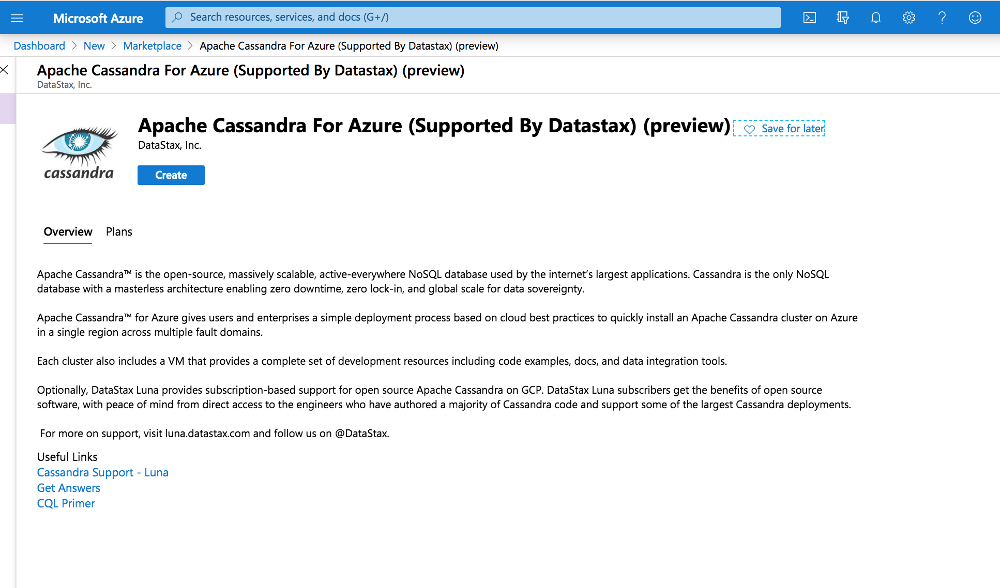

Click "Create" to get started

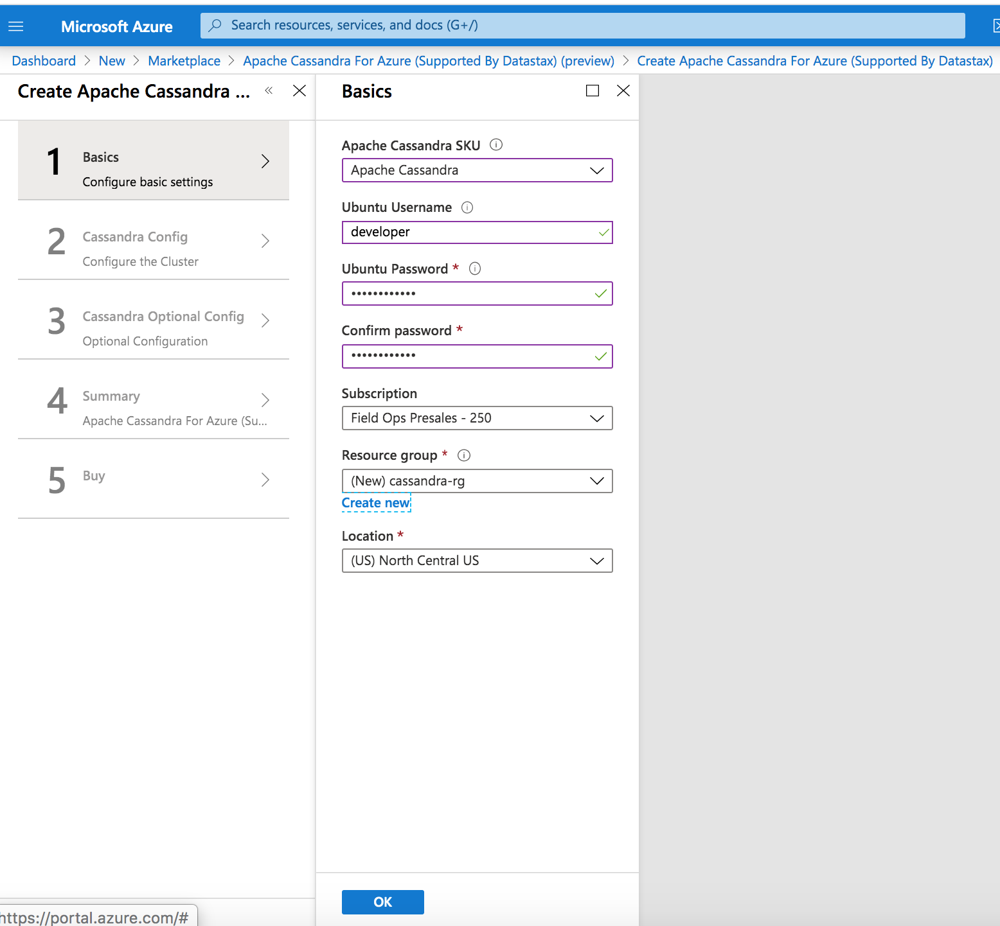

This is the basic configuration page where you enter the VM credentials, resource group and region of choice. Hit "OK" to continue.

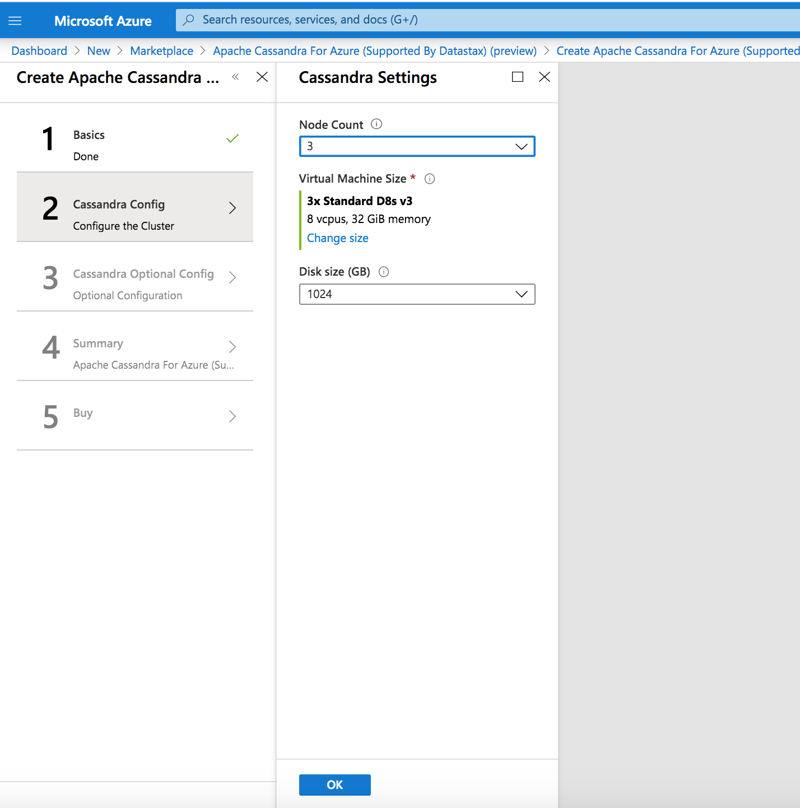

This is the first Cassandra configuration page where you enter the node count, shape of the VM for each Cassandra Node and the disk size of choice. Hit "OK" to continue.

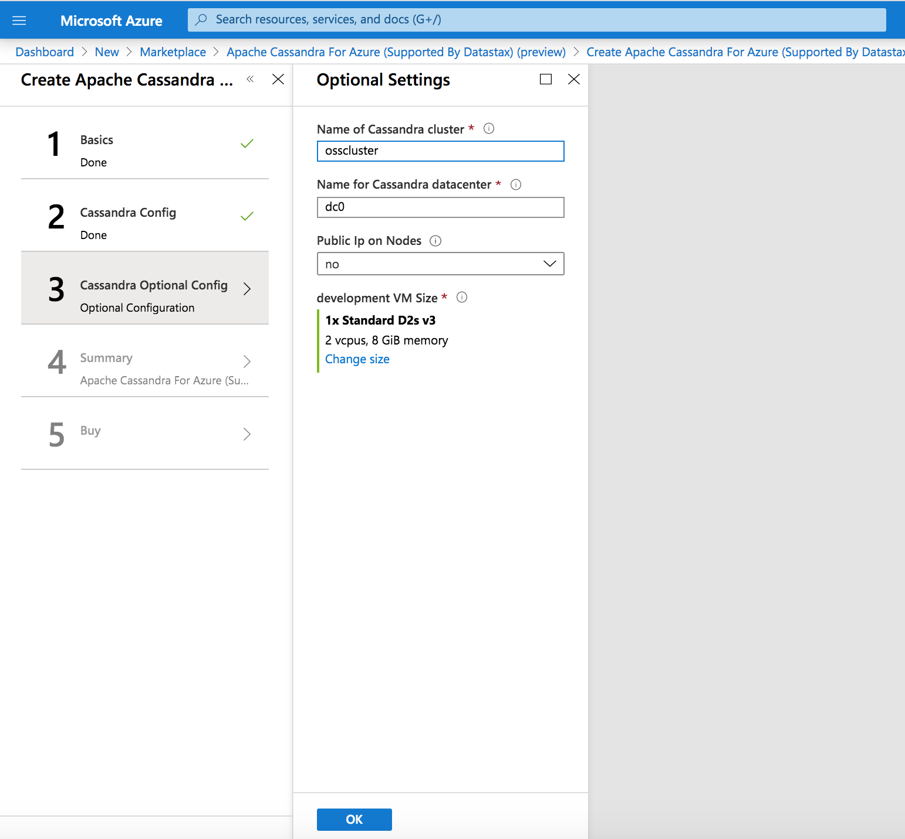

This is the second Cassandra configuration page where you enter the cluster_name, datacenter name, whether you want public IPs on the nodes and the shape of the development VM. Hit "OK" to continue.

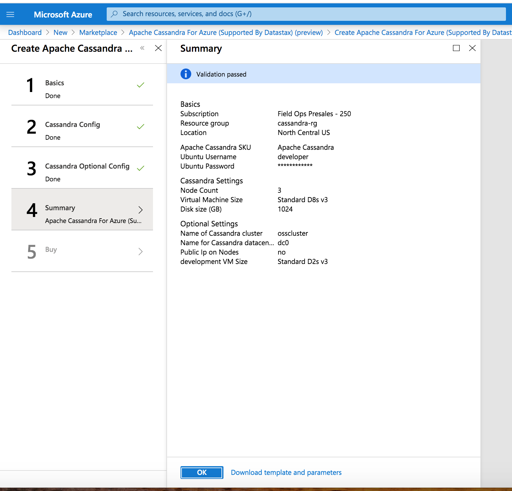

This is the summary page where you check the configuration before launching. Hit "OK" to continue.

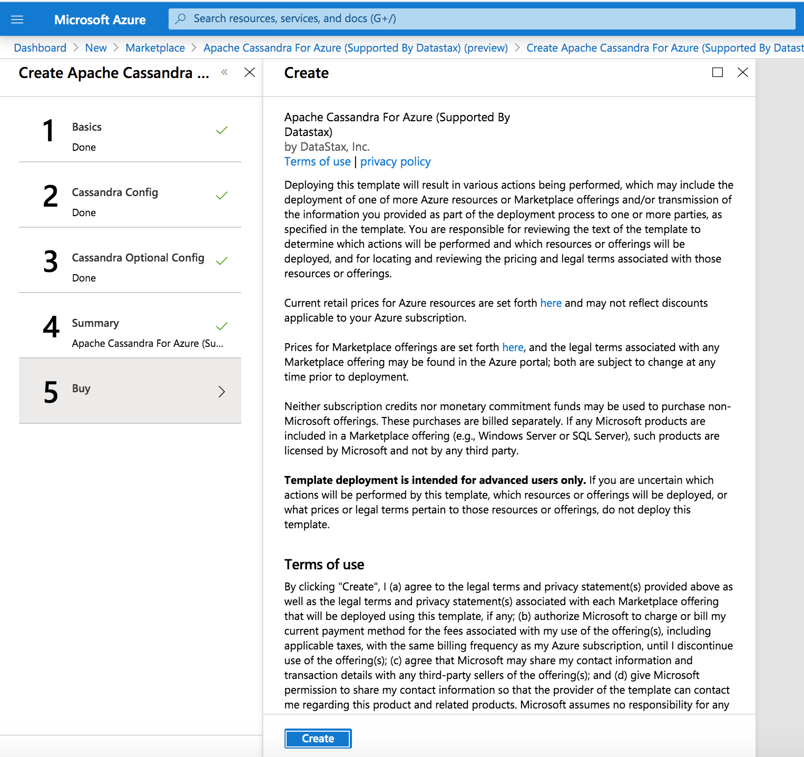

This is the terms and conditions page where you accept them and start the deployment. Hit "Create" to continue.

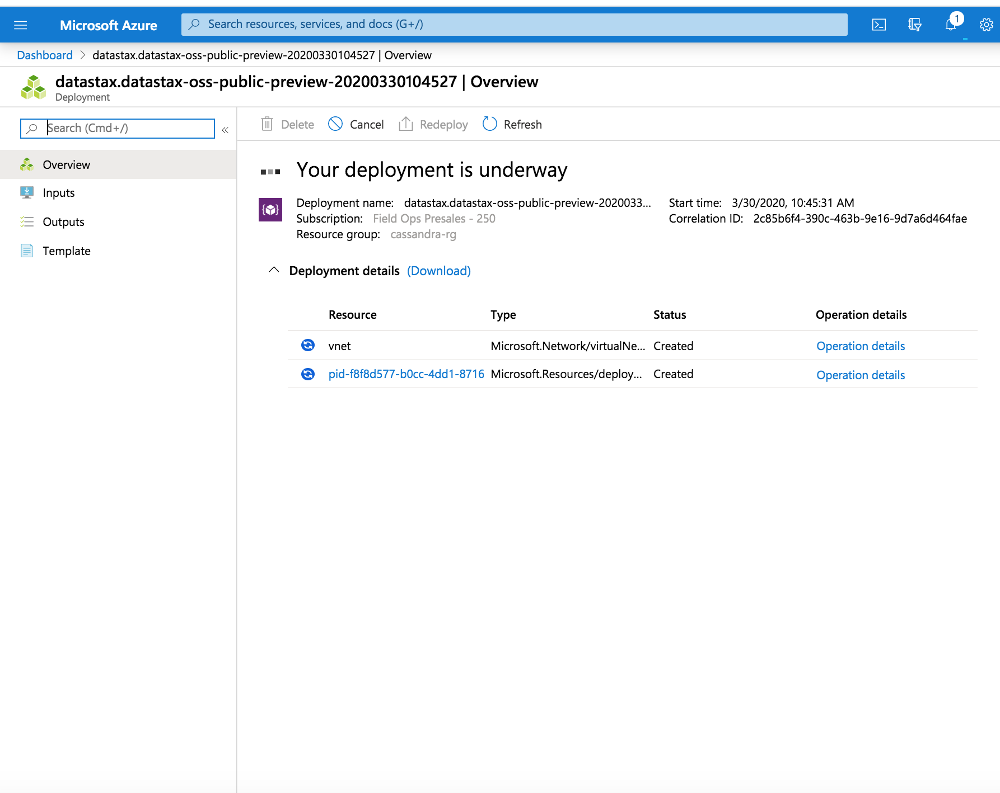

Once the deployment starts, you are able to track it's progress in the portal. This screen shows it is still deploying.

## Inspecting the Cluster

When complete you should see:

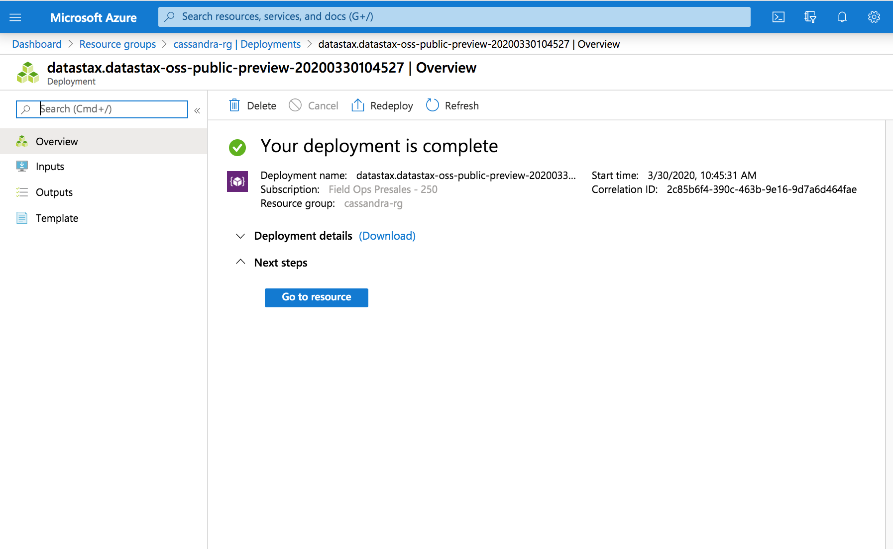

To get started, click on the "outputs" in the left navigation bar. You will see the url for the web server. Open this in a browser.

This will take you to the getting started web page and here you will have access to documents and how to get support:

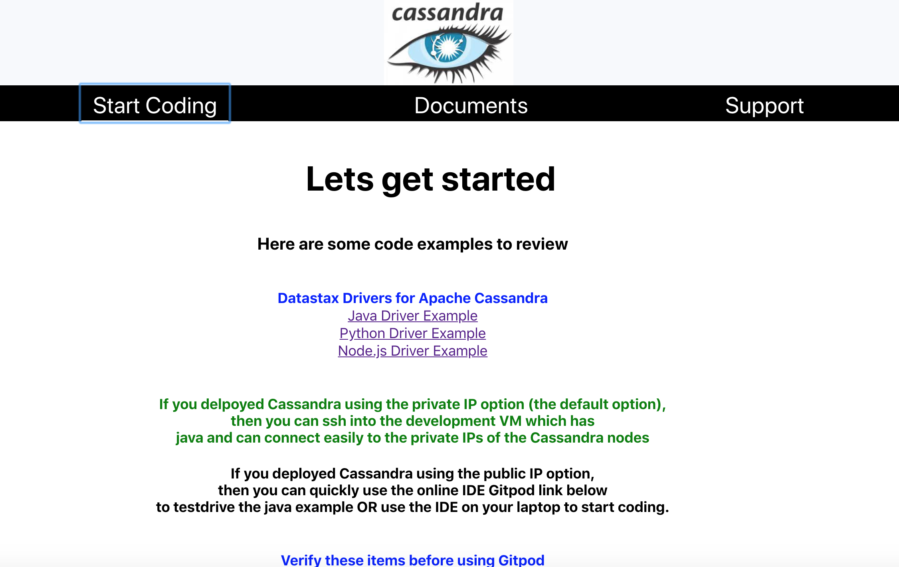

Next you can log into a node to interact with the database. To do that go back to the Azure console and start an ssh session on one of the Cassandra nodes. This can be done by using the devops VM as a jump box or if you have public IPs enabled than ssh directly into the node.  Once you on the VM type in "nodetool status":

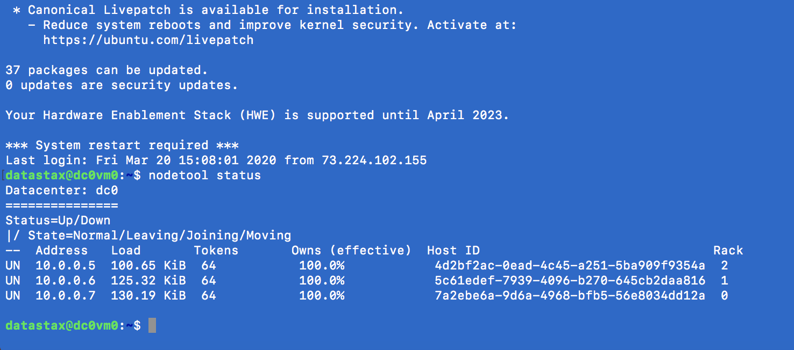

You can also run "cqlsh" and describe the keyspaces:

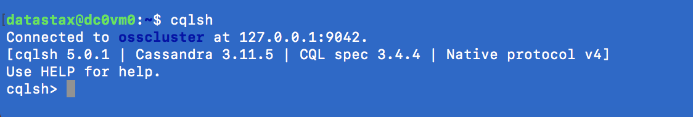

## Next Steps

If you want to learn more about DataStax Enterprise, the online training courses at https://academy.datastax.com/ are a great place to start.

To learn more about support for this offer go to https://luna.datastax.com.

To learn more about the Datastax managed service go to https://www.datastax.com/cloud/datastax-astra/ 
