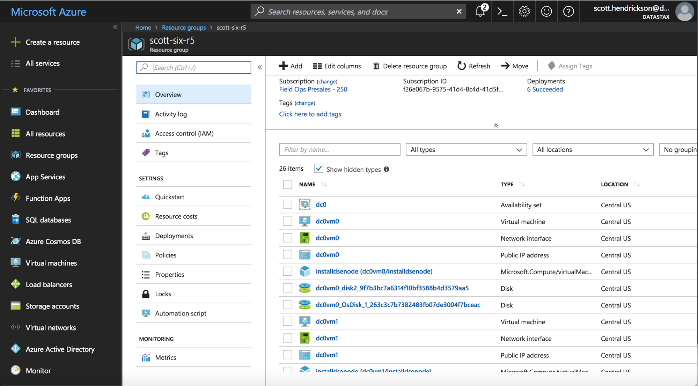
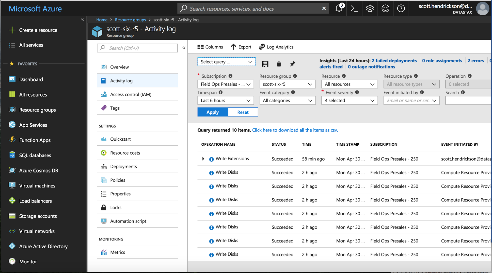

# Post Deploy

## Debugging Azure Deployments

In the event a deployment doesn't complete successfully, there are steps you can take to understand the problem. Some notes and debugging techniques are described below.

Most of the failures we see with Azure deployments are the result of insufficient quotas in the Azure subscription. Limited cores are the primary offender. Default subscriptions have a limit of 20 cores and trial subscriptions have much less. If you want to raise the limit or quota above the “Default Limit”, open an online customer support request at no charge. Learn more about this [here](https://docs.microsoft.com/en-us/azure/azure-supportability/resource-manager-core-quotas-request). With trial subscriptions, you can upgrade to a Pay-As-You-Go subscription which will increase quota.

One way to debug deployment issues is through the Azure portal. After logging in at https://portal.azure.com, find the resources group associated with the deployment. Once you click on that resource group you will see a screen like the one below.

From here click on the “Activity log” to view successful and failed resources in this deployment.

From the command line, you can find similar information at the command line using a command like this: `az group deployment show -g resouceGroupName -n mainTemplate --debug`

Rarely errors happen in the ARM template extensions that install Datastax. To debug these issues, users can ssh into a VM and look at various files. One file that shows this data is under `/var/lib/waagent`. Under this directory are sub-directories that will contain files from the extension running. A directory like `Microsoft.OSTCExtensions.CustomScriptForLinux-1.5.2.2/download/0` will contain files named `stdout` and `errout` which should give indication of the errors.

Usually the best course of action when a deployment fails is to delete the azure resource group and deploy again. Please contact the Datastax at partner-architecture@datastax.com when errors occur.

## Next Steps

Once you've deployed a cluster on Azure, there are some security next steps that may be useful as well as some videos to help with your development on this cluster.

### Datastax Academy
Datastax Academy is the place to start on your learning path. Once you have registered and have an account, look into these video links to get started.

* [Data Model and CQL: CQL DDL](https://academy.datastax.com/units/data-model-and-cql-cql-ddl)

* [Traversing graph data: graph traversal steps](https://academy.datastax.com/units/traversing-graph-data-graph-traversal-steps)

* [Spark SQL: Spark SQL basics ](https://academy.datastax.com/units/spark-sql-spark-sql-basics)

### Security
You may want to change the Azure network security groups to further lock down the environment. A good overview of network security can be found [here](https://docs.microsoft.com/en-us/azure/virtual-network/security-overview)
On the Datastax side, SSL between nodes can be enabled and is cover in this [documentation](https://docs.datastax.com/en/dse/6.0/dse-admin/datastax_enterprise/security/secInternodeSsl.html).
